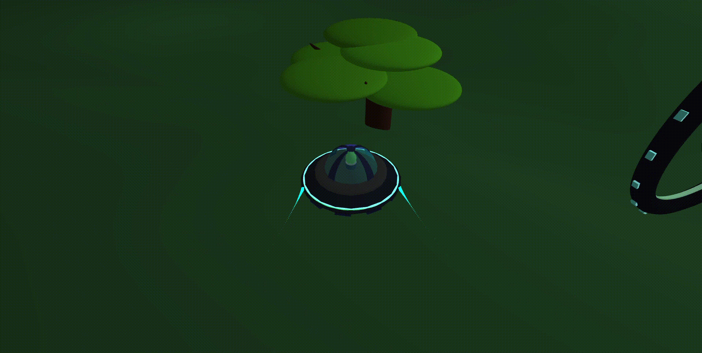

# Area 1 Low Fat

A game created by Alison Schonauer and Hoang Nguyen for Fall 2025 CS 134 Final Project

🎬 [Watch the trailer](https://youtu.be/_43Ez1hhYu4)

A 3D physics and collision engine built in C++ with openFrameworks, featuring custom rigid-body motion and octree-accelerated collision detection.

## Overview

Built to understand how physics engines simulate motion and detect collisions under the hood, rather than relying on a pre-built engine's physics system. Focuses on accurate force accumulation and efficient broad-phase collision detection at scale.

## Features

- Custom physics simulation using Euler integration for gravity and external force accumulation
- AABB (Axis-Aligned Bounding Box) collision detection
- Octree spatial partitioning to optimize collision query performance

## How it works

## Built with

- C++
- openFrameworks
